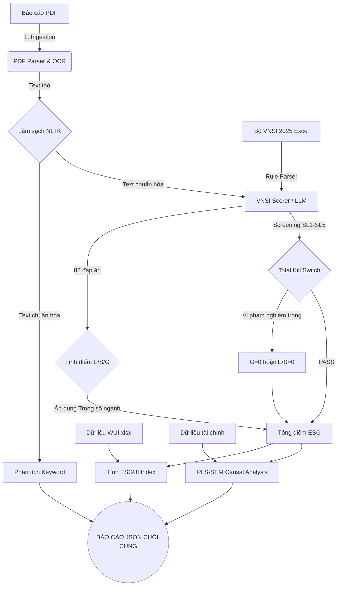

# Luồng Hoạt Động (Workflow) của Hệ thống ESG

Hệ thống hoạt động theo một Pipeline tuyến tính gồm 6 giai đoạn (Phase). Quá trình này được điều phối hoàn toàn tự động bởi file `main.py`.

## Sơ đồ Luồng Dữ Liệu

## Chi Tiết Các Giai Đoạn (Phases)

### [Phase 0] Khởi tạo Bộ Quy Tắc (Rules Parsing)
Hệ thống đọc file Excel `20250506 - VNSI.xlsx`. Nó bóc tách các sheet để lấy ra: 5 câu sàng lọc, 82 câu hỏi đánh giá, logic tính điểm từng câu (VD: A thì +1 điểm, B thì 0 điểm), và trọng số ngành. Kết quả được lưu tĩnh vào các file `.json` trong thư mục `outputs/` để dùng cho những lần sau nhằm tiết kiệm thời gian.

### [Phase 1] Tiêu hóa Dữ liệu (Ingestion & OCR)
Đọc file PDF Báo cáo Thường niên. Đây là bước nặng nhất về mặt I/O.
- Nếu PDF là text chuẩn: đọc trực tiếp trong 1 giây.
- Nếu PDF là file ảnh scan (<30% text): Kích hoạt `tesseract` để quét quang học (OCR) từng trang. Mất khoảng 10 phút. Toàn bộ text lấy được sẽ bị ném qua module `text_cleaner.py` (dùng NLTK) để xóa bỏ khoảng trắng thừa, xóa ký tự đặc biệt và dọn dẹp stopwords tiếng Việt.

### [Phase 2] Phân tích Từ Khóa (Keyword Analytics)
Sử dụng bộ từ điển tĩnh (`dictionary.json`), hệ thống đếm số lần xuất hiện của các từ khóa mang tính rủi ro (như "biến động", "thách thức", "thiệt hại") và phát hiện xem doanh nghiệp có nhắc đến chứng chỉ ISO nào không (như ISO 9001, ISO 14001).

### [Phase 3] Chấm điểm bằng LLM (Scoring)
Đây là giai đoạn cốt lõi và tốn thời gian tính toán nhất. Nó chia làm 2 phần:
1. **Screening (Sàng lọc):** LLM phân tích 5 câu hỏi chí mạng (SL1-SL5). Nếu phát hiện vi phạm luật, hệ thống kích hoạt **Total Kill Switch** (Hạ điểm Quản trị - G về 0, hoặc hạ Môi trường/Xã hội về 0).
2. **VNSI Scoring:** LLM đánh giá 82 câu hỏi. Để tránh việc mô hình bị "quá tải ngữ cảnh" (context limit), hệ thống dùng kỹ thuật *Smart Chunking* — nó tìm kiếm các đoạn text có chứa các từ khóa liên quan đến câu hỏi trước, rồi mới gửi đoạn text đó lên cho LLM. Điểm số sau đó được nhân với trọng số GICS (Ví dụ ACB là Financials → G=60%, S=30%, E=10%).

### [Phase 4] Đánh giá Rủi ro (ESGUI)
Sau khi có điểm ESG, hệ thống đọc dữ liệu bất ổn vĩ mô từ file `WUI.xlsx` của đúng năm đó. Sau đó tính ra chỉ số ESGUI bằng công thức:
`ESGUI = (1 - ESG/100) * (1 + WUI)`
ESGUI cuối cùng cho biết doanh nghiệp này nằm ở vùng an toàn hay rủi ro cao.

### [Phase 5] Phân tích Nhân quả (PLS-SEM)
Hệ thống độc lập load một tập dữ liệu tài chính (26 DN x 11 năm) từ `Data (4).xlsx`. Nó dùng thư viện `semopy` để chạy mô hình kinh tế lượng đo lường xem: Điểm ESG cao liệu có thật sự làm tăng Lợi nhuận (ROA) hay không?

### Kết xuất Báo Cáo
Tất cả dữ liệu từ Phase 1 đến Phase 5 được gom lại thành một cục JSON duy nhất và lưu vào `outputs/reports/`. Hệ thống cũng in ra một bản tóm tắt đẹp mắt lên màn hình Terminal.
